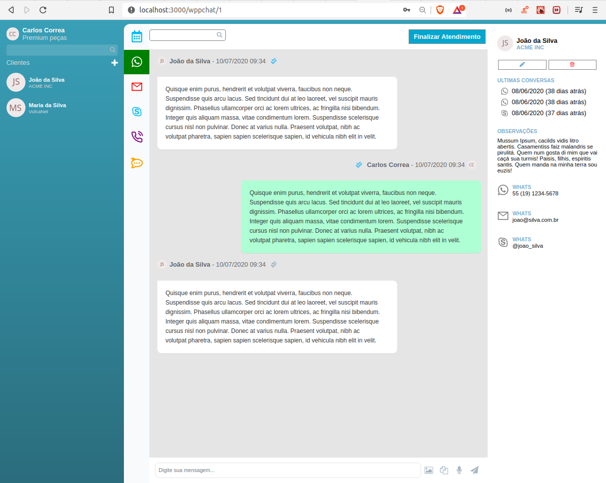

# Desafio02_VulcaNet

<div align="center">


</div>

## Passo a passo

Com Yarn
```
$ git clone https://github.com/MarcusMartins38/Desafio02_VulcaNet.git
$ cd Desafio02_VulcaNet
$ yarn
$ yarn start
```
Com Npm

```
$ git clone https://github.com/MarcusMartins38/Desafio02_VulcaNet.git
$ cd Desafio02_VulcaNet
$ npm install
$ npm start
```
